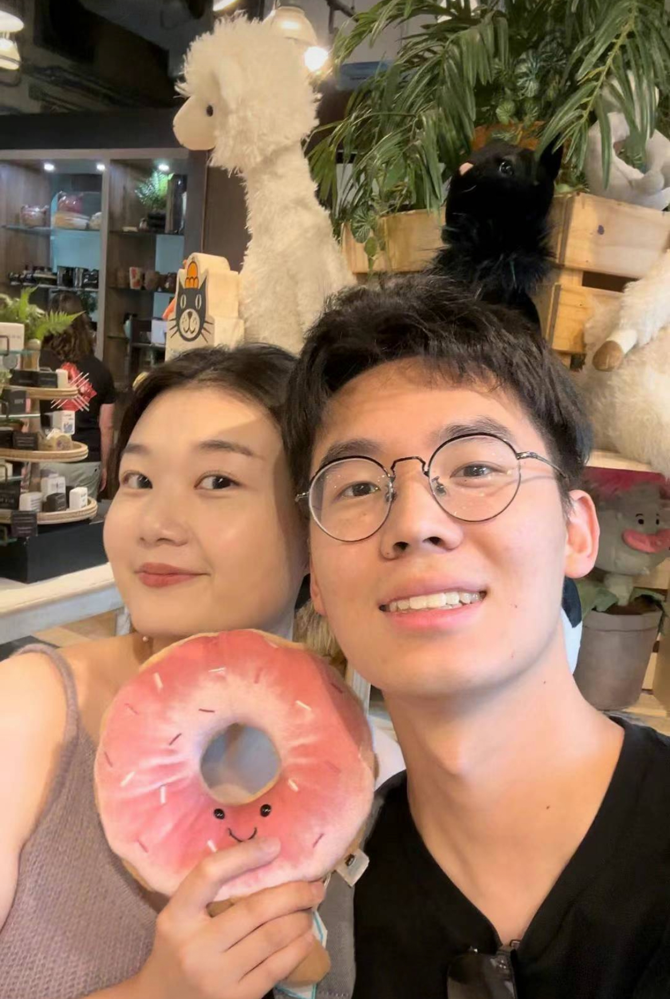

# Hi there! 👋 Welcome to Xiangye's Website

*This is a picture of My girlfriend and Me!*

---

## 👤 About me
- Hey, I am Xiangye or you can call me Shawn!

- I am currently a master student in **Applied Mathematics** of **University of Waterloo** but I will be graduating in Nov. 2025! I had my undergraduate in **Applied mathematics & Statistics** from 2019-2023.

## 💼 Work
- Machine learning intern in research team in *Environment and Climate Change Canada* in 2024 developing/testing encoder-decoder model for weather modeling.
- Data scientist intern in health intelligence team in *Region of Peel* in 2025 validating model in public health.
- Machine learning intern in *Institut Pasteur* in 2023 for pattern detection for medical image.

## ⚽ Sports & Interest
- I really like soccer and I keep playing soccer over 15 years while less frequent now.
- I play table tennis but not really good
- I like video games like Elden Rings, FIFA and Crusader Kings III.
- I spent 6 months this year to learn how to train an AI game agent for Clash Royale just for fun starting from collecting game episodes as datasets and training from the sractch but the results are not really good, if you are interested, come and talk!

---

## 🚀 My Projects
Here are some of the things I’ve worked on:

- <i class="fas fa-microchip"></i> [**Project 1: Image-to-Text**](/projects/project1.md)  
  - Fine-tuned a ResNet–Transformer encoder-decoder model for handwritten image-to-text tasks  

- <i class="fas fa-microchip"></i> [**Project 2: Clash-Royale AI Agent 🏰⚔️**](/projects/project2.md)  
  - Developed a Clash Royale AI agent with *Visual-Fusion → Policy Training*  

- <i class="fas fa-microchip"></i> [**Project 3: Sensitive Quantization on LLM**](/projects/project3.html)  
  - Applied *sensitive weights-based quantization* for Large Language Models  

---

