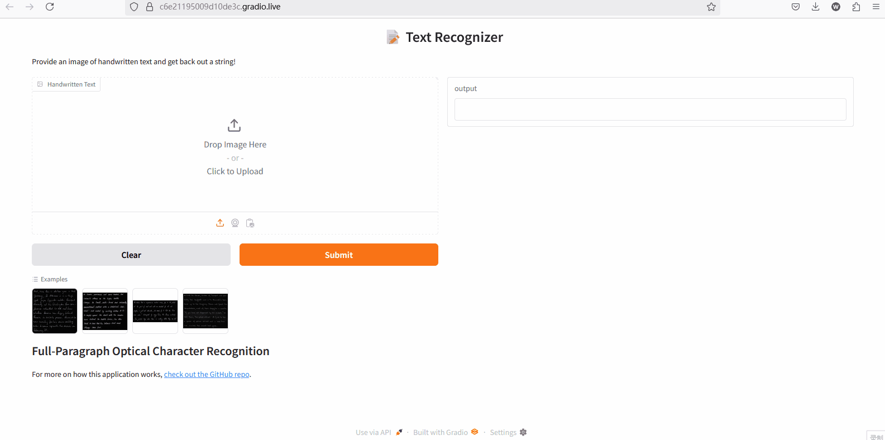

# My Projects 🚀

# 🧠 ResNetTransformer-Gradio UI

This is my Learning Process including data collection, data argumentation, Model Fine-tune integrating with lighning and W&B for experiment design, local deployment and now I am working on cloud deployment using AWS ECR and lambda.
---

## 📊 Training Visualization

You can explore full training logs, metrics, and visualizations on WandB:

👉 [View on Weights & Biases](https://wandb.ai/xiangyexu-university-of-waterloo/image_to_text?nw=nwuserxiangyexu)

---

## ✨ UI Preview
An interactive interface built with Gradio for the fine-tuned ResNetTransformer model. Designed for image translation tasks using a combination of convolutional and transformer-based features.

Here’s a quick look at the interface in action:

---

## 🚀 Features

- 🔍 Upload images for prediction
- ⚡ Real-time inference using ResNetTransformer backend
- 🧩 Modular and easy to extend
- 🌐 Gradio-powered web interface

---

## 📦 Installation & Setup

# Clone the repository
git clone https://github.com/shawnxu0407/Image_to_Text.git
cd your_working_dir

# Launch the Gradio interface
python gradio_UI/app.py

