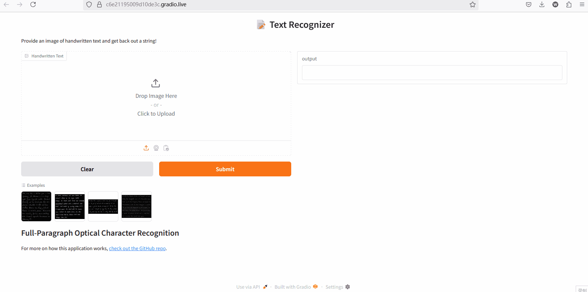

# 🧠 ResNet-Transformer Gradio UI
    A deep learning framework for recognition the hand written image.

## ✨ UI Preview
An interactive interface built with Gradio for the fine-tuned ResNetTransformer model. Designed for image translation tasks using a combination of convolutional and transformer-based features.

Here’s a quick look at the interface in action:

---

## 🔬 Modeling Process

1. **Data Preprocessing**  
   - Applied resizing, normalization, and augmentation (flips, crops) to improve generalization.  

2. **Model Architecture**  
   - **ResNet Encoder** for robust visual feature extraction.  
   - **Transformer Decoder** to generate natural-language text sequences.  
   - Fine-tuned with LoRa being high efficient training.

3. **Training**  
   - Implemented in PyTorch and Torch-Lightning.  
   - Monitored metrics (loss curves) with **Weights & Biases**.
  
4. **Deployment**  
   - Local deployment with **Docker** 📦 for environment test.
   - Use AWS ECR for cloud deployment & inference.

## 📊 Training Visualization

You can explore full training logs, metrics, and visualizations on WandB:

👉 [View on Weights & Biases](https://wandb.ai/xiangyexu-university-of-waterloo/image_to_text?nw=nwuserxiangyexu)

---

## 🚀 Features

- 🔍 Upload images for prediction
- ⚡ Real-time inference using ResNetTransformer backend
- 🧩 Modular and easy to extend
- 🌐 Gradio-powered web interface

---

## 📦 Installation & Setup

# Clone the repository
git clone https://github.com/shawnxu0407/Image_to_Text.git
cd your_working_dir

# Launch the Gradio interface
python gradio_UI/app.py

