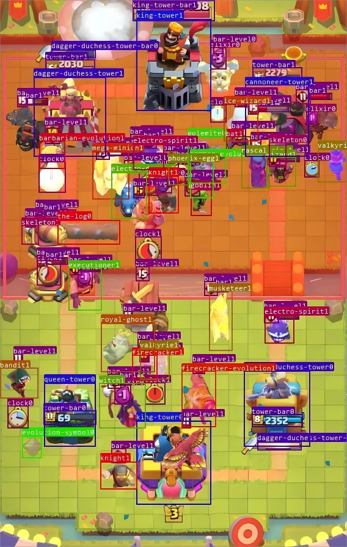
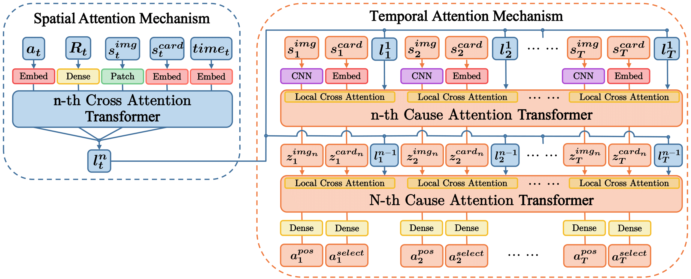
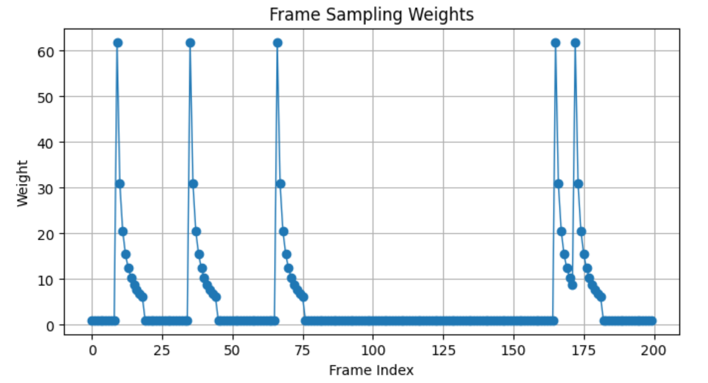

## AI Agent Visualization 🎮🤖

## 🔬 Brief Project Flow 📝

- Since we have no access to the internal control for Clash Royale, so that no direct information to extract state, action, and reward for traditional online training in Reinforcement Learning. We have to build the visual detection block to extract the necessary information for training data. 

- Refer to the [GitHub repo](https://github.com/shawnxu0407/Clash_Royale_agent) for the code.

1. **Dataset/Episode Collection 📸**
   - 1.1 Use [Scrcpy](https://github.com/Genymobile/scrcpy) and **FFmpeg** to access the Android phone screen and extract the game episode frames (later add the link for the dataset collection). Notice we have to use the Expert datasets.
   
   - 1.2 Prepare troops segments for generative arena images, which is the training dataset for visual detection model YOLOv8:
  
   
     
3. **Visual Detection/ Data Processing 🔍**
   - 2.1 **State builder** (torch_state_builder.py): Use trained YOLOv8 for arena information extraction to build state **s**, use ResNet classification to extract info for deployed cards and elixir, use cnocr to extract actual time.
   
   - 2.2 **Action builder** (torch_action_builder.py): Use ResNet classification to visually detect card deployments.
   
   - 2.3 **Reward builder** (torch_reward_builder.py): Use cnocr to detect queen and king tower HP deduction.
   
   - 2.4 Every frame would have the corresponding state (s) 🟢, action (a) ⚡, and reward (r) ⭐

4. **Policy Network Construction 🧠**
   
 

6. **AWS Sagemaker Training ☁️**

## Training Dataset Construction 🗂️

1. The keys of **state (s)** are [arena, cards, elixir]. The trained YOLO model gives inference on arena detection results and detected troops with keys [position, class, belongings]. The ResNet model detects the cards table, showing only 4 cards at a time. cnocr detects remaining elixir.

2. The keys of **action (a)** are [select, pos] representing selected cards and deployment positions in the arena. The arena is divided into 32x18 sub-blocks.

3. The key of **reward (r)** is the scalar reward 🏅. Positive reward if opposite tower HP is reduced, negative otherwise.

4. Dataloading process: each timestep t has (s, a, r) pairs. The sequential construction is necessary for transformer decoder model.
   - Sequential Dataloader: Each sequence is length n (ex. 30), with the first 29 input pairs predicting the 30th pair.

5. **Sparse Action Addressing ⚡**
   
 

The actual action frames get higher weights 🏋️‍♂️, and neighboring frames get decaying weights.

## Model Structure Discussion 🏗️

0. Quick View of Model
   - View the whole model as a learning framework that takes the first $n-1$ items and produce the $n$-th item like a time sequence modeling where we can "open" each item spatially as we have lots of information for each time on the game arena like deployed cards, time, what the arena looks like (any enemy on the playground?)...

1. Spatial Latent representation
   - The very first important concept in this model uses the cross attention mechanism to produce the spatial latent representation at each time step $l_t$.
  

   - For each fixed time step t, apply a cross attention mechanism on [state_embedding, action_embedding, reward_embedding], where state_embedding is [image_patches_embedding, elixir_embedding, cards_embedding], action_embedding is [select_embedding, position_embedding] and reward_embedding is purely the embedding of scalr reward of each time step.

  
   
   - The reason to apply cross attention to the combination of embedding is try to build the similarity scores between items. For example, the image patches sub-divide the original image into smaller parts, and use cross attention, the model would learn that the cards deployment position is more related to one of all patches that some specific cards is more related to some specific part of whole arena which is related to some high rewards for fixed time.
  

   - The purpose of whole spatial latent representation is trying to learn a high dimensional representation of vectors to represent the "similarities among all items spatially" for each time step.

2. Time Sequence Modeling
   - Given we have the spatial local latent representation $l_t$, we also build the global representations $x^t_g$. In this case, the emphasis is no longer on the local spatial (arena) side but on the reasoning over time steps.
  

   - We first embed the image and cards, and concatenate spatial latent $l_t$ to form $x^t_g$ at time t, and we apply cause attention to all the global embeddings $x^t_g$.

  
   - The cause attention works like this: when we work on the global embedding at time step $t=9$, we compute the similarties score of $x^9_g$ among all the previous embeddings. We do not compute the future similarities as we try to let the model make decision on the previous steps without knowing any future information. (otherwise it is cheating!)

## References 📚
1. [Clash Royale AI studies](https://wty-yy.xyz/posts/12073/)

2. [Decision Transformer: Reinforcement Learning via Sequence Modeling](https://arxiv.org/abs/2106.01345)

